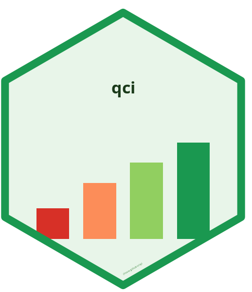

# qci 

<!-- badges: start -->
[](https://github.com/choxos/qci/actions/workflows/R-CMD-check.yaml)
[](https://choxos.github.io/qci/)
[](https://opensource.org/licenses/MIT)
[](https://orcid.org/0000-0002-2460-2394)
<!-- badges: end -->

**Quality of Care Index for Global Burden of Disease Studies**

`qci` provides a complete, reproducible pipeline for calculating the Quality of Care Index (QCI) from [Global Burden of Disease (GBD)](https://www.healthdata.org/research-analysis/gbd) study data. QCI is a composite country-level metric (0--100) derived via Principal Component Analysis that quantifies healthcare quality for any disease or condition.

## Methodology

The QCI is computed from four epidemiological ratios derived from GBD estimates:

| Ratio | Formula | Interpretation |
|-------|---------|----------------|
| **MIR** | Deaths / Incidence | Mortality-to-Incidence: case fatality |
| **YLLtoYLD** | YLLs / YLDs | Premature death vs. disability burden |
| **DALtoPER** | DALYs / Prevalence | Disease burden per prevalent case |
| **PERtoINC** | Prevalence / Incidence | Disease duration (chronicity) |

These ratios are combined via PCA, normalized to 0--100, and inverted so that **higher scores = better quality of care**. The analysis is stratified by sex and age group, and preserves GBD uncertainty intervals throughout.

For full methodology details, see the [QCI Protocol](https://dx.doi.org/10.17504/protocols.io.bprjmm4n) (Mohammadi et al., 2020).

## Installation

```r
# Install from GitHub
# install.packages("devtools")
devtools::install_github("choxos/qci")
```

## Quick Start

```r
library(qci)

# Run the complete pipeline on a GBD CSV export
result <- qci_pipeline("path/to/gbd_export.csv")

# Or use bundled sample data
result <- qci_pipeline(sample_gbd)

# View QCI scores
result$wide[, .(location_name, year, sex_name, qci_score)]
```

### Loading GBD Data

Export data from the [GBD Results Tool](https://vizhub.healthdata.org/gbd-results/) with all 6 measures (Deaths, Incidence, Prevalence, DALYs, YLLs, YLDs). Multiple CSV files are automatically merged:

```r
result <- qci_pipeline(c("gbd_part1.csv", "gbd_part2.csv", "gbd_part3.csv"))
```

### Gender Disparity Analysis

```r
gdr <- qci_gdr(result$wide)
gdr[year == 2019, .(location_name, qci_female, qci_male, gdr, gdr_category)]
```

### Visualization

```r
# Choropleth map
map_data <- merge_location_type(result$wide)
plot_qci_map(map_data, years = c(1990, 2019))

# Gender disparity map
gdr_data <- merge_location_type(qci_gdr(result$wide))
plot_gdr_map(gdr_data, years = c(1990, 2019))

# Time series
plot_qci_trend(result$wide, locations = c("Japan", "Brazil", "Nigeria"))

# Distribution comparison
plot_qci_distribution(result$wide, years = c(1990, 2019))

# Male vs Female scatter
plot_qci_scatter(map_data, year = 2019, color_by = "type")
```

## Step-by-Step Usage

For full control over each processing step:

```r
# 1. Load GBD CSV data
gbd <- qci_load("gbd_export.csv")

# 2. Clean, filter, and reshape
cleaned <- qci_clean(gbd)

# 3. Compute epidemiological ratios
with_ratios <- qci_ratios(cleaned$wide_number)

# 4. Run PCA and compute QCI scores
pca_result <- qci_pca(with_ratios)

# 5. Gender Disparity Ratio
gdr <- qci_gdr(pca_result$data)

# 6. Export results
qci_export_csv(pca_result$data, "qci_results.csv")
qci_export_dta(pca_result$data, "qci_results.dta")
```

## Function Reference

### Core Pipeline

| Function | Description |
|----------|-------------|
| `qci_pipeline()` | Complete end-to-end pipeline (CSV to QCI scores) |
| `qci_load()` | Load and merge GBD CSV exports |
| `qci_clean()` | Filter locations/ages, reshape to wide format |
| `qci_ratios()` | Compute MIR, YLLtoYLD, DALtoPER, PERtoINC with uncertainty |
| `qci_pca()` | PCA scoring stratified by sex/age, normalized to 0--100 |
| `qci_gdr()` | Gender Disparity Ratio (Female QCI / Male QCI) |

### Visualization

| Function | Description |
|----------|-------------|
| `plot_qci_map()` | World choropleth map with quantile-based color scale |
| `plot_gdr_map()` | Gender disparity choropleth map |
| `plot_qci_trend()` | QCI time series by sex |
| `plot_qci_distribution()` | Density plots comparing sex distributions |
| `plot_qci_scatter()` | Male vs Female QCI scatter by region |

### Export

| Function | Description |
|----------|-------------|
| `qci_export_csv()` | Export results to CSV |
| `qci_export_dta()` | Export results to Stata .dta format |
| `merge_location_type()` | Add ISO3 codes and location classification |

## Data Requirements

GBD CSV exports must include:

- **Measures**: Deaths, Incidence, Prevalence, DALYs, YLDs, YLLs
- **Metrics**: Rate (required); Number and Percent are optional
- **Columns**: `measure_name`, `location_id`, `location_name`, `sex_name`, `age_name`, `metric_name`, `year`, `val`, `upper`, `lower`

The package works with **any GBD cause** (e.g., cancers, cardiovascular diseases, infectious diseases).

## Citation

If you use this package in your research, please cite:

> Sofi-Mahmudi A (2026). *qci: Quality of Care Index from Global Burden of Disease Data*. R package version 0.1.0. <https://choxos.github.io/qci/>

and the QCI protocol:

> Mohammadi E, Ghasemi E, Saeedi Moghaddam S, Yoosefi M, Ghanbari A, Ahmadi N, Masinaei M, Roshani S, Ebrahimi N, Rouhifard Khalilabad M, Nasserinejad M, Azadnajafabad S, Mohajer B, Mohebi F, Rezaei N, Mokdad A, Larijani B, Farzadfar F (2020). "Quality of Care Index (QCI)." *protocols.io*. doi: [10.17504/protocols.io.bprjmm4n](https://dx.doi.org/10.17504/protocols.io.bprjmm4n)

## Author

Ahmad Sofi-Mahmudi ([](https://orcid.org/0000-0002-2460-2394))

## License

MIT License. See [LICENSE](LICENSE) for details.
